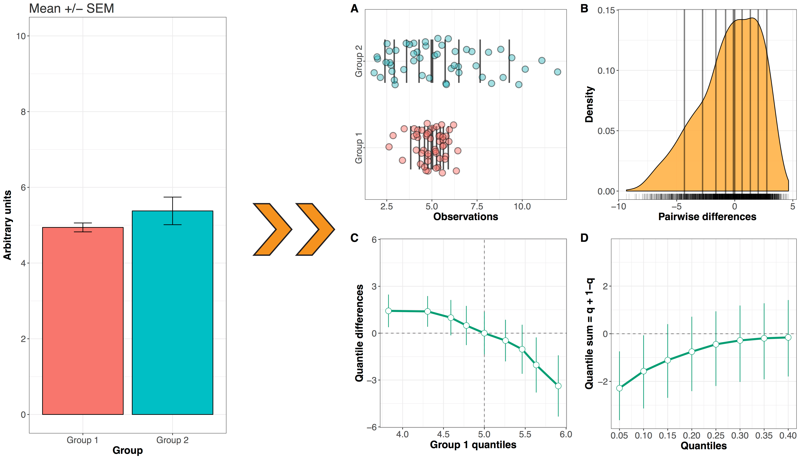

# `matrogme`

Matlab Robust Graphical Methods For Group Comparisons (v. 0.0.9000)

The `matrogme` Matlab toolbox provides graphical tools and robust statistical methods to compare groups of continous and pseudo-continuous observations. The goal is to illustrate and quantify how and by how much groups differ. The current version of the package is limited to comparing two groups (though multiple pairs of groups can be compared in one go). Future developments will extend the tools to deal with multiple groups, interactions and hierarchical designs.

## About `matrogme`

### Installation

1. Download the toolbox by clicking the "Clone or download" green button, then "Download ZIP".
2. Add the `mfiles` folder to your Matlab path.

### Approach

The approach behind the package can be summarised in one figure:

 **How two independent distributions differ. Left**: standard but misleading bar graphs of mean values. **Right**: detailed graphical methods. **A.** Stripcharts of marginal distributions. Vertical lines mark the deciles, with a thicker line for the median. **B.** Kernel density representation and rug plot of the distribution of difference scores. Vertical lines mark the deciles, with a thicker line for the median. **C.** Shift function. Group 1 - Group 2 is plotted along the y-axis for each decile (white disk), as a function of Group 1 deciles. The vertical lines indicate 95% bootstrap confidence intervals. The shift function can be sparser or denser by changing the quantiles. **D.** Difference asymmetry function with 95% bootstrap confidence intervals.

The approach is also described in these articles:

[A few simple steps to improve the description of group results in neuroscience](http://onlinelibrary.wiley.com/doi/10.1111/ejn.13400/full)

[Beyond differences in means: robust graphical methods to compare two groups in neuroscience](https://www.biorxiv.org/content/early/2017/03/27/121079). \[[Reproducibility package using `rogme`, the R version of `matrogme`](https://figshare.com/articles/Modern_graphical_methods_to_compare_two_groups_of_observations/4055970)\]

The main statistical functions were developed by Rand Wilcox, as part of his [`WRS`](https://dornsife.usc.edu/labs/rwilcox/software/) R package.

The main tool in `matrogme` is the [shift function](https://garstats.wordpress.com/2016/07/12/shift-function/). A shift function shows the difference between the quantiles of two groups as a function of the quantiles of one group. For inferences, the function returns an uncertainty interval for each quantile difference. By default, the deciles are used. Currently, confidence intervals are computed using one of two percentile bootstrap techniques. Highest density intervals and [Bayesian bootstrap](https://github.com/rasmusab/bayesboot) intervals will be available eventually.

## Main functions

All the functions rely on the [Harrell-Davis quantile estimator](https://garstats.wordpress.com/2016/06/09/the-harrell-davis-quantile-estimator/), computed by the `hd()` function.

### Abbreviations
*pb* = percentile bootstrap

*ci* = confidence interval

*se* = standard error

### Shift function
The shift function for deciles using *pb* *se* estimation is computed using:

- `shifthd()` for independent groups

- `shiftdhd()` for dependent groups

Shift function for deciles using *pb* *ci* without *se* estimation:

- `shifthd_pbci()` for independent groups

- `shiftdhd_pbci()` for dependent groups

You can see the shift function in action [here](https://garstats.wordpress.com/2016/07/29/matlab-shift-function/). In addition to the plot option available for each function, the four types of Matlab shift functions can be plotted using `shift_fig()`.

### Difference asymmetry function

- `diffall_asym()` for independent groups

- `diff_asym()` for dependent groups

You can see the difference asymmetry function in action [here](https://garstats.wordpress.com/2016/07/19/typical-differences/). 

The difference asymmetry function is a new approach to quantify asymmetries in difference distributions. To understand this approach, we first need to consider how difference scores are usually characterised. It helps to remember that for continuous distributions, the Mann—Whitney—Wilcoxon (MWW) U statistics is the sum of the number of times observations in group X are larger than observations in group Y. Concretely, this calculation requires to compute all pairwise differences between X and Y, and then count the number of positive differences. And the MWW test assesses P(X>Y) = 0.5. Essentially, the MWW test is a non-parametric test of the hypothesis that the distributions are identical. The MWW test does not compare the medians of the marginal distributions as often stated; it is based on an estimate of the median of the difference scores, but it uses the wrong standard error when distributions differ (Cliff, 1996). A more powerful test is Cliff’s delta, which uses P(X>Y) - P(X<Y) as a measure of effect size. Wilcox (2012)’s approach is an extension of the MWW test: the idea is to get a sense of the asymmetry of the difference distribution by computing a sum of quantiles = q + (1-q), for various quantiles estimated using the Harrell-Davis estimator. 

### One sample estimation
- `decilesci()` to compute *ci* of the deciles of one distribution, with *pb* estimation of the *se* of the deciles.
- `decilespbci()` to compute *pb* *ci* of the deciles of one distribution, without *se* estimation.

## Citation

If you use this code, please cite:

Rousselet, G.A., Pernet, C.R. & Wilcox, R.R. (2017) 
**Beyond differences in means: robust graphical methods to compare two groups in neuroscience.** 
The European journal of neuroscience, 46, 1738-1748.
[https://www.ncbi.nlm.nih.gov/pubmed/28544058](https://www.ncbi.nlm.nih.gov/pubmed/28544058)

## Feedback

If you have any question or suggestion, don’t hesitate to get in touch by email or by submitting an issue. Also, please do get in touch if you use the tools implemented in this toolbox. We would love to be able to showcase examples in our teaching, in workshops and in other publications. More importantly, we’d like to know the code is helping to improve standards in neuroscience, psychology and other disciplines.

## References

Cliff, N. (1996) Ordinal methods for behavioral data analysis. Erlbaum, Mahwah, N.J.

Rousselet, G.A., Pernet, C.R. & Wilcox, R.R. (2017) Beyond differences in means: robust graphical methods to compare two groups in neuroscience. The European journal of neuroscience, 46, 1738-1748.

Wilcox, R.R. (2012) Comparing Two Independent Groups Via a Quantile Generalization of the Wilcoxon-Mann-Whitney Test. Journal of Modern Applied Statistical Methods, 11, 296-302.

